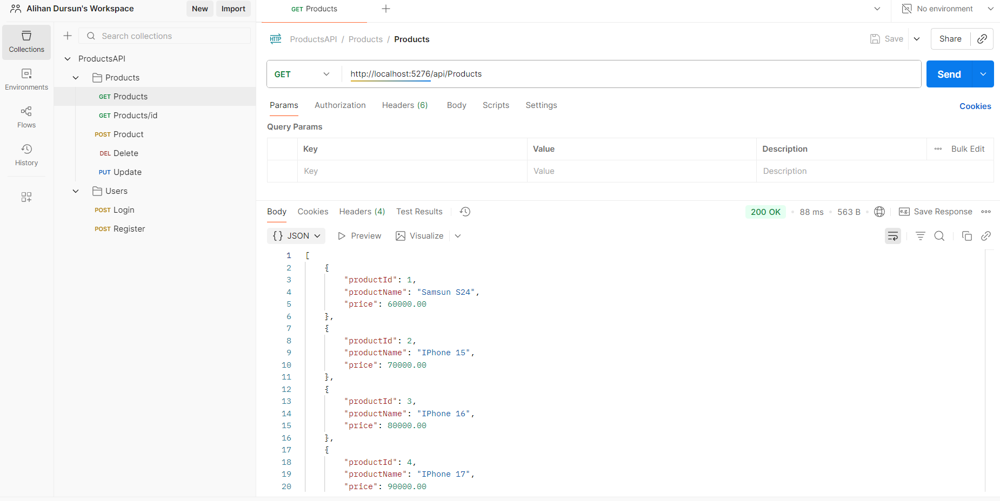
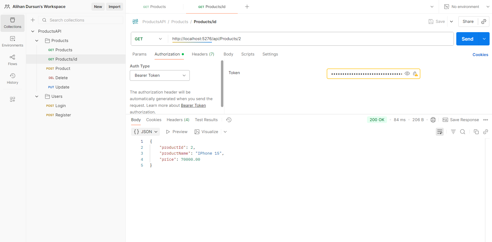
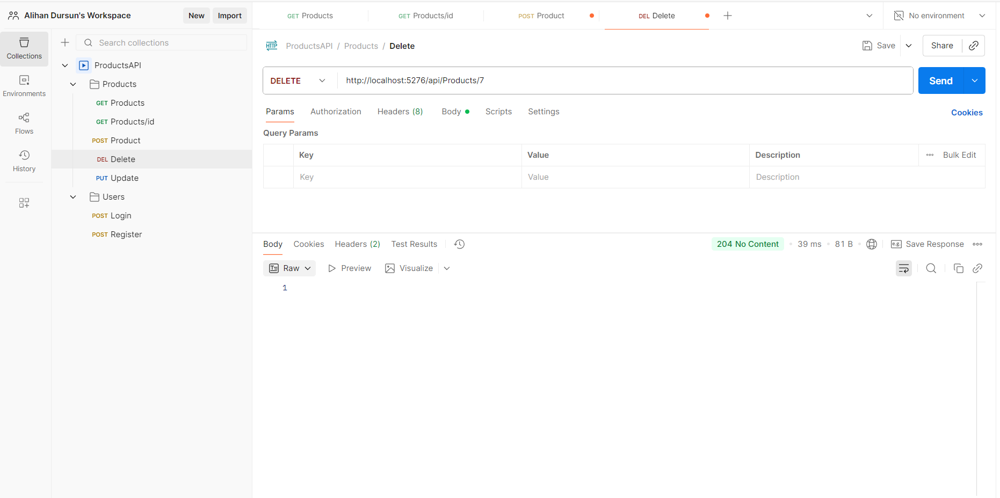
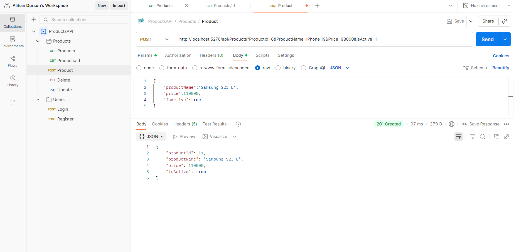
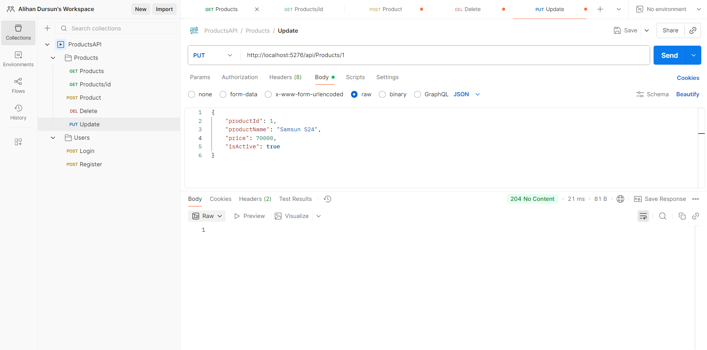
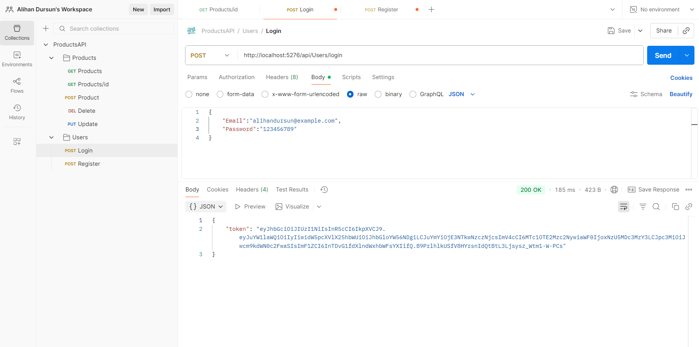
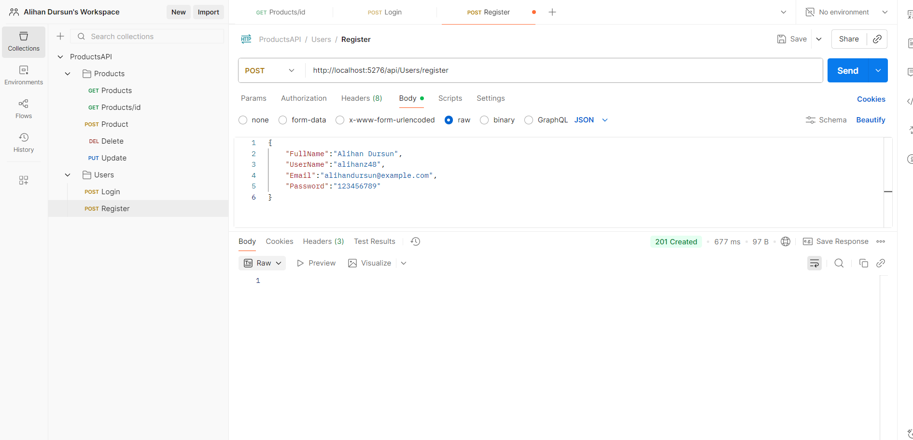

# 🛒 Kullanıcı ve Ürün Yönetimi REST API

Bu proje, **ASP.NET Core Web API** kullanılarak geliştirilmiş bir **RESTful API** uygulamasıdır.  
Kullanıcı kimlik doğrulama (JWT), ürün ekleme/güncelleme/silme/listeleme gibi temel özellikleri destekler.  

---

## 🚀 Özellikler

### 👤 Kullanıcı İşlemleri
- Kullanıcı kaydı (**Register**)
- Kullanıcı girişi (**Login**)
- JWT token üretimi
- Token doğrulama ile yetkilendirme

### 📦 Ürün İşlemleri
- Ürün listeleme (**GET**)
- Ürün detaylarını getirme (**GET by ID**)
- Yeni ürün ekleme (**POST**)
- Ürün güncelleme (**PUT**)
- Ürün silme (**DELETE**)

---

## 🛠 Kullanılan Teknolojiler
- **ASP.NET Core 7 Web API**
- **Entity Framework Core**
- **SQL Server**
- **Identity**
- **JWT (JSON Web Token)**
- **Swagger** (API test ve dokümantasyon için)

---

## 🖼️ Uygulamadan Görseller

